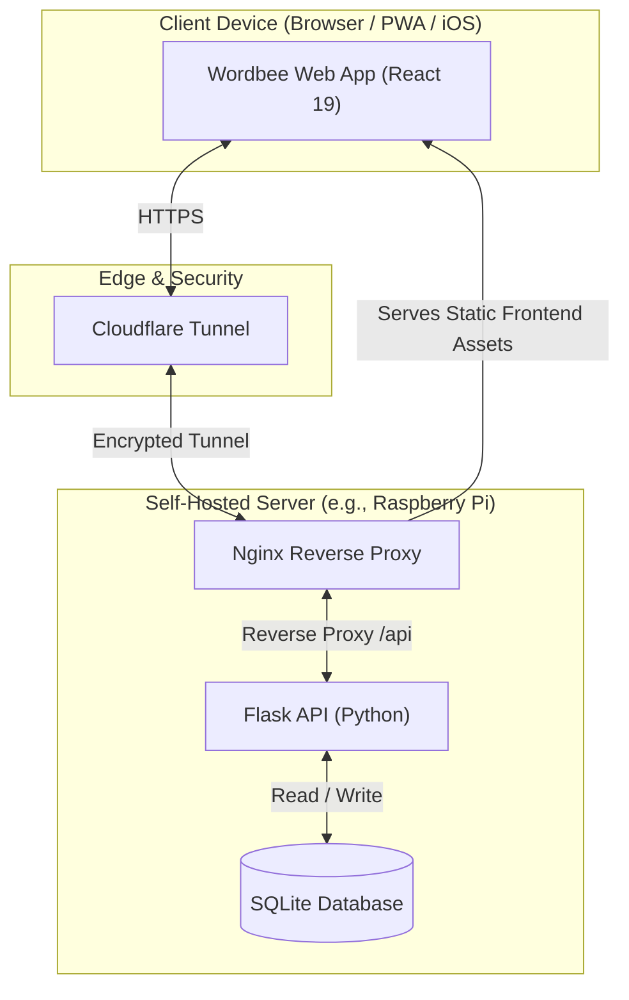

# Wordbee

<p align="center">
  <strong>Wordbee</strong> is a self-hosted private games hub for a friends-and-family group. It brings your favorite games together under a clean, unified React 19 interface:
</p>

<div align="center">

- 🟩 **Wordle**
- 🟨 **Connections**
- 🔵 **Strands**
- 🔢 **Sudoku**
- 📦 **Letter Boxed**
- 🐝 **Spelling Bee**
- 🎨 **Tiles**
- 📰 **The Crossword**
- ⚡ **The Mini**
- 🎼 **The Midi**
- 🎲 **Pips** *(Soon)*

</div>

<p align="center">
  
  
  
  
  
  
  
  
</p>

---

## 🎮 What it does

Wordbee hosts multiple daily and archive puzzles for a private community of friends and family. It includes built-in daily lockout guards, statistics dashboards, and local persistent state synchronization.

> [!NOTE]
> **Friends & Family Access**: The majority of Wordbee's features (such as profile registration, custom avatars, persistent statistics, and history) are locked behind a private access code. Because Wordbee is self-hosted, you can set your own access codes to unlock the site for your family. See [Access Code Configuration](#access-code-configuration) for setup steps.

### Supported Games

| Game | Gameplay Modes | Key Features |
|---|---|---|
| **Wordle** | Daily / Endless / Past-Date | Tile reveal animations, high-contrast & dark mode, starter-word habits, trends, and detailed solve-path analysis |
| **Sudoku** | Daily / Past-Date (Easy/Medium/Hard) | Single-row keypad, Notes/pencil marks, Undo, Erase, Hint, a running timer, live conflict highlighting, and auto-checked completion |
| **Connections** | Daily / Past-Date | 16-card board, 4-card group validation, faithful NYT select/solve-bounce/mistake-shake animations, one-away feedback, and post-loss reveal |
| **Strands** | Daily / Past-Date | Drag or tap path selection, connect-the-dots lines, spangram validation, bonus-word tracking, and an NYT-style theme-word hint |
| **Letter Boxed** | Daily / Past-Date | Faithful square-box board, tap or keyboard letter entry, live word-chaining and side-constraint rules, all-letters solve detection, words-vs-NYT solve insight, and a reveal-solution option |
| **Spelling Bee** | Daily / Past-Date | Faithful honeycomb hive, tap or keyboard entry, letter shuffle, live NYT scoring, the Beginner→Genius rank ladder (+ Queen Bee), pangram detection, and an ever-growing found-words list that merges across devices |
| **Tiles** | Daily / Past-Date / Endless Zen | Seeded deterministic solvable board, custom designer art reskinning palettes (including Brighton, Soho, Utrecht, etc.), custom selection/BG/font styling, and live combo tracking |
| **The Crossword** | Daily / Past-Date | Full 15×15 (Sunday 21×21) grid, tap/keyboard entry with across↔down toggle and clue-bar navigation, Check & Reveal (square/word/puzzle), an autocheck toggle, a running timer, and server-side answer validation. History reaches the first NYT crossword (1942); requested gap dates snap to the nearest published puzzle |
| **The Mini** | Daily / Past-Date | NYT's free 5×5 mini — the same grid UI as The Crossword (across↔down toggle, clue bar, Check & Reveal, autocheck, timer, server-side validation). History reaches the first Mini (2014) |
| **The Midi** | Daily / Past-Date | NYT's 9×9–11×11 midi — the same grid UI as The Crossword. History reaches the first Midi (2026) |

<details>
<summary>🔍 Detailed Game & Platform Features</summary>

- **Per-Game Archive History**: Every game has its own daily / past-date picker that grays out days before that game's first puzzle and clamps out-of-range dates back into the playable window, mirroring Wordle.
- **Local Puzzle Caches**: All game playback and answers are served from the local database folders, allowing complete offline execution of historical and daily games without relying on live publisher connections.
- **Wordle Solve Analysis Cache**: To keep dashboard loads fast, CPU-heavy solve analysis is computed once at solve-time and cached in the `friends_family_daily_analysis` table, bypassing recomputations on subsequent page queries.
- **Completion Calendar**: Each signed-in user has a per-game calendar back to that game's first puzzle, colored solid green (solved live), washed green (solved from the archive), light red (missed live), and pink (missed from the archive). Tapping a day shows that solve, with current-day privacy preserved.
- **Daily Persistence & Rollover**: Signed-in family users resume unfinished puzzles (any game) from the server. Rollovers resolve to `America/Chicago` by default, blocking future gameplay before Central midnight. The active game and archive date persist for the browser session, so an in-app reload returns where you were while a fresh launch opens the daily Wordle.
- **Friends-and-Family Access**: Private access codes are validated server-side, profiles are reclaimed on load, and one active session is enforced per browser/user.
- **Avatar Profiles**: Profile avatars are rendered from DB-backed state using DiceBear's Notionists SVG API.
- **Stats Dashboard**: Only live daily completions count toward stats; retroactive archive plays are recorded for the calendar but excluded from every stat. The Wordle dashboard contains accolade cards, solve distribution, starter-word history, player trends, skill/luck analysis, and play reviews. Sudoku, Connections, Strands, Letter Boxed, and Spelling Bee add family solve-rate, leaderboard, daily review, and calendar views. Spelling Bee, being open-ended (no win/lose), instead tracks rank/score metrics — Genius rate, average puzzle %, words, pangrams, Queen Bees, and a daily average-% trend against the Genius line.
- **Privacy Controls**: Current-day answers, guesses, and results remain locked in statistics and the calendar until the requesting user solves that day's puzzle for that game.
</details>

## 🗄️ Database & Archive Backfill Architecture

Wordbee stores gameplay history and user accounts centrally, but isolates heavy game puzzle payloads into dedicated game-specific SQLite database files. This decoupled architecture keeps the main application database lightweight and fully decoupled from game-specific schemas.

### Database File Layout

All databases are stored in the `data/` directory:

| Database File | Scope / Purpose | Data Contents |
|---|---|---|
| `wordbee.sqlite` | Core Application | User profiles, active sessions, completed results, daily attempts, and the global backfill status ledger (`archive_status`) |
| `wordle.sqlite` | Wordle Cache | Daily answers, lengths, and publication metadata |
| `connections.sqlite` | Connections Cache | Daily category groups, cards, and source metadata |
| `strands.sqlite` | Strands Cache | Daily clues, grid boards, allowed words, spangrams, and theme paths |
| `sudoku.sqlite` | Sudoku Cache | Board grids and solution numbers mapped by date and difficulty level |
| `letterboxed.sqlite` | Letter Boxed Cache | Letter sets, par, and local validation dictionary |
| `spellingbee.sqlite` | Spelling Bee Cache | Honeycomb letter sets, pangrams, and acceptable words |
| `tiles.sqlite` | Tiles Cache | Captured reskinnable SVG symbols, theme colors, and attribution |
| `crossword.sqlite` | Crossword Cache | Grids, clue coordinates, title, author, editor, and solutions |
| `mini.sqlite` | Mini Cache | 5x5 Mini grids, clue coordinates, author, editor, and solutions |
| `midi.sqlite` | Midi Cache | 9x9–11x11 Midi grids, clue coordinates, author, editor, and solutions |

---

### Archive Backfill Pipelines

To achieve complete source independence, Wordbee includes CLI backfillers in the `scripts/` folder. Backfill coverage and status (e.g. `confirmed`, `generated`, `missing`, `error`) are tracked in the central `archive_status` ledger table in `wordbee.sqlite`. This ensures all backfills are resumable, skipping already confirmed dates on subsequent runs.

<details>
<summary><b>Wordle, Connections, Strands (Cookie-Free / Fast API)</b></summary>

- **CLI Tool**: `python3 scripts/backfill_archive.py --game <game_key>`
- **Mechanism**: Walks date ranges and downloads puzzles directly from the publisher's daily JSON endpoints. Since these endpoints are public and unauthenticated, no subscriber cookies are required, and the backfill runs very quickly and reliably.
- **Default Pacing**: `--pace 1.5` seconds between requests.
</details>

<details>
<summary><b>Sudoku & Letter Boxed (Wayback Machine Scrapes & Cooldowns)</b></summary>

- **CLI Tool**: `python3 scripts/backfill_archive.py --game sudoku` or `--game letterboxed`
- **Mechanism**: No historical dated puzzle endpoints exist for these games, so past dates are recovered from the Internet Archive (Wayback Machine) by probing candidates around the day's rollover window.
- **Adaptive Cooldown**: Wayback Machine APIs filter generic user agents and aggressively rate-limit or firewall requests. The script presents a browser User-Agent and uses an adaptive cooldown (backing off for 15–60 seconds on repeated misses) to prevent IP blocking. Confirmed days are skipped, and missing days can be safely retried.
- **Letter Boxed Backup**: For Letter Boxed, the script first queries `letterboxedanswers.com` (complete coverage, no rate limit) to get the board and NYT solution, and then derives the validation dictionary locally from a bundled 80,000+ word list (`letterboxed_words.txt`).
- **Fallbacks**: If Wayback and answers sites are unavailable, the game falls back to deterministic generated Sudoku boards or a bundled board from `letterboxed_fallback.json`.
</details>

<details>
<summary><b>Spelling Bee (nytbee.com / Hive Reconstruction)</b></summary>

- **CLI Tool**: `python3 scripts/spellingbee_backfill.py`
- **Mechanism**: Reaches back to launch (2018-05-09). Instead of probing Wayback, it fetches from `nytbee.com` (not rate-limited, complete coverage) to extract the official daily word list.
- **Board derivation**: The script dynamically derives the honeycomb board geometry from the word list: the center letter is the one letter common to every single answer; the seven outer letters are extracted from the list; and the pangrams are those answers that contain all seven letters. This allows complete board reconstruction without needing NYT's proprietary endpoints.
- **Warmup Caching**: Today's live page conveniently carries the past ~two weeks in one fetch, which the warmup loop caches automatically.
</details>

<details>
<summary><b>The Crossword (Newest-First Paging & GitHub Import)</b></summary>

- **CLI Tool**: `python3 scripts/crossword_backfill.py`
- **Mechanism**: Deep history back to the first NYT crossword on 1942-02-15 (gapless from 1993-11-21). Crossword bodies are subscriber-only, requiring a valid `NYT_COOKIE` exported from the browser devtools.
- **Paging Optimization**: Instead of probing every calendar day (which would be extremely wasteful for the sparse pre-1993 era), the script pages the dated crossword **listing** newest-first in 100-result windows, then downloads the grid + clues for each discovered puzzle.
- **GitHub Import Utility**: To avoid thousands of HTTP requests, developers can download the `doshea/nyt_crosswords` JSON archive into `External References/CrosswordsToConvert` and run:
  ```bash
  python3 scripts/convert_github_crosswords.py
  ```
  This script processes all JSON files, normalizes the grids and clues, inserts them into `crossword.sqlite`, and writes them to the `archive_status` ledger as `confirmed` (with note `github-import`).
</details>

<details>
<summary><b>The Mini & The Midi (Dated subscriber endpoints & Reconstructed Grids)</b></summary>

- **CLI Tool**: `python3 scripts/mini_backfill.py` and `python3 scripts/midi_backfill.py`
- **Mechanism**: Walks daily history (Mini since 2014-08-21, Midi since 2026-02-25) via the subscriber-only `v6/puzzle` endpoints, requiring `NYT_COOKIE`.
- **Daily Refresh (No Cookie)**: Today's games refresh cookie-free:
  - **The Mini**: Free public endpoint `v2/puzzle/mini.json` is fetched.
  - **The Midi**: Grid geometry is reconstructed dynamically on the fly by combining today's free public metadata dimensions (`v2/puzzle/midi.json`) with a third-party clue/answer list (`word.tips`). The backend runs a reading-order backtracking search to find a unique block layout. If it cannot find a unique solution, it falls back to a cookie-fetched lookup.
</details>

<details>
<summary><b>Tiles Palette Art Capture (SVG Scraping)</b></summary>

- **CLI Tool**: `python3 scripts/tiles_backfill.py`
- **Mechanism**: Tiles has no daily board to download (it generates boards locally and deterministically using a seeded RNG based on the date). However, the designer art palettes (colors + SVGs) rotate. Sourcing all 14 palettes requires `NYT_COOKIE`.
- **Discovery**: The script queries NYT's live catalog to discover new palettes, fetches their SVGs and color schemes, and caches them in `tiles.sqlite`. The default "brighton" palette is bundled as a fallback so Tiles is fully playable offline.
</details>

---

## 🏗️ Architecture



---

## 📂 Project Structure

```text
.
├── backend/        # Flask API, SQLite database access, game modules, stats, and auth
├── data/           # Local SQLite database files (ignored by Git)
├── docs/           # Database schema planning, API reference, and auth planning notes
├── frontend/       # Vite + React client source code and features (Wordle, Connections, etc.)
├── infra/          # System configuration templates (nginx, systemd, cloudflared)
├── tests/          # Test execution notes and smoke-test config
├── package.json    # Root command aliases for full-stack development
└── README.md
```

<details>
<summary>📂 Codebase Details</summary>

- **Frontend Structure**: App state and routing are orchestrated in `frontend/src/App.tsx`. Game views are separated in `features/wordle/`, `features/sudoku/`, `features/connections/`, `features/strands/`, `features/letterboxed/`, `features/spellingbee/`, `features/tiles/`, and `features/crossword/`. Common layouts and settings are stored in `features/avatar/`, `features/access/`, and `features/stats/`.
- **Backend Structure**: Shared API endpoints live in `backend/app/routes.py`. Game logic and puzzle services are modularized under `backend/app/games/` — a `registry.py` wires each game (`connections.py`, `strands.py`, `sudoku.py`, `letterboxed.py`, `spellingbee.py`, `tiles.py`, `crossword.py`, `mini.py`, `midi.py`) into the shared daily/archive/stats plumbing. Letter Boxed, Spelling Bee, Tiles, The Crossword, The Mini, and The Midi keep their raw puzzle data in dedicated databases via `letterboxed_db.py` / `spellingbee_db.py` / `tiles_db.py` / `crossword_db.py` / `mini_db.py` / `midi_db.py`. The Crossword sources today and past days from NYT's dated, subscriber-only crossword endpoints (a listing that maps each date to a puzzle id, then the puzzle's grid + clues), authenticated with the operator's `NYT_COOKIE`. The Mini and Midi (`mini.py`/`midi.py`, `mini_db.py`/`midi_db.py`, sharing grid helpers in `grid_common.py`) reuse that same grid shape and the Crossword's UI, but their **daily refresh needs no cookie**: the Mini is free, so today comes from NYT's public `v2/puzzle/mini.json` (answers included); the Midi is subscriber-only, so its geometry is reconstructed (`midi_reconstruct.py`) from a third-party daily clue list (word.tips) plus the free `v2/puzzle/midi.json` dimensions — only a *uniquely* reconstructable grid is stored, so a wrong grid is never confirmed. The `NYT_COOKIE` is used only to backfill their history (and to backstop the rare day the Midi can't be uniquely reconstructed).
</details>

---

## 🚀 Getting Started

### 1. Prerequisites & Installation

Clone the repository and install the dependencies:

```bash
# Clone the repository
git clone https://github.com/MatthewBisbee/Wordbee.git
cd Wordbee

# Install Frontend dependencies
npm --prefix frontend install

# Install Backend dependencies
python3 -m pip install -r backend/requirements.txt
```

### 2. Configure Environment

Copy the template env file:

```bash
cp .env.example .env
```

> [!IMPORTANT]
> Make sure to update the `.env` file before running the application. Important settings:
> - `SECRET_KEY`: Long, random string for signing user sessions.
> - `WORDBEE_PUZZLE_TIMEZONE`: Timezone for game rollover (defaults to `America/Chicago`).

### 🔑 Access Code Configuration

To unlock profile creation and history features, define your private custom group and code in your `.env` file:

1. Open your `.env` file.
2. Edit the `WORDBEE_FRIENDS_FAMILY_CODES` value to match your desired group name and access code:
   ```env
   WORDBEE_FRIENDS_FAMILY_CODES=myfamily:my_secret_code
   ```
   *(e.g., `myfamily` is the group identifier, and `my_secret_code` is the code users type to gain entry).*
3. Multiple groups/codes can be defined if needed, separated by commas.

### 🍪 NYT Cookie Configuration (Optional)

To backfill subscriber-only archives (The Crossword, The Mini, The Midi historical history, and Tiles palettes), add your logged-in NYT session cookie to your `.env` file:

```env
NYT_COOKIE="NYT-S=...; nyt-a=...; ..."
```

*(You can copy this string from the `Cookie` header of any puzzle request in your browser's developer tools Network tab while logged into the New York Times website).*

---

## 💻 Local Development

Use the root-level scripts in `package.json` to run the stack:

| Command | Description |
|---|---|
| `npm run dev` | Runs Flask (`127.0.0.1:5001`) and Vite (`0.0.0.0:5173`) for LAN network testing |
| `npm run dev:local` | Runs Flask and Vite restricted to localhost (`127.0.0.1`) only |
| `npm run api` | Starts only the Flask backend |
| `npm run dev:frontend` | Starts only the Vite frontend dev server |
| `npm run build` | Builds the frontend project into production assets |
| `npm run lint` | Lints the frontend code using Oxlint |

---

## 📡 Data & Content Sources

Wordbee pulls board data dynamically and stores it locally in SQLite:
- **Puzzles**: Daily answers are fetched from public dated puzzle endpoints.
- **Fallback**: Fallbacks are generated deterministically if third-party endpoints fail during start.
- **Definitions**: Integrated with the Free Dictionary API and Datamuse API for Wordle details.
- **Avatars**: Profiles are generated with DiceBear's Notionists SVG endpoint.

---

## 🗺️ Roadmap & Progress

- [x] **Wordbee Game Picker Shell**
- [x] **Wordle Integration** (Daily, Endless, Archive)
- [x] **Sudoku Module** (Mistakes, cell highlighting)
- [x] **Connections Module** (Grid matching, history)
- [x] **Strands Module** (Word paths, spangram reveal)
- [x] **Letter Boxed Module** (Square box board, word chaining, local dictionary, reveal solutions)
- [x] **Spelling Bee Module** (Honeycomb hive, NYT scoring & ranks, cross-device found-words merge, local puzzle cache)
- [x] **Tiles Module** (Seeded deterministic board generation, endless Zen mode, reskinnable SVGs, captured art palettes)
- [x] **The Crossword Module** (Full grid, Sunday sizing, across/down toggles, clue bar, autocheck/timer, local historical archive since 1942, GitHub archive import utility)
- [x] **The Mini & The Midi Modules** (Cookie-free daily refresh grids, subscriber-only archive backfiller, Midi geometry backtracking reconstruction solver)
- [x] **Friends & Family Account Profiles**
- [x] **Detailed Solve Stats & Accolades** (cached solve analysis for fast dashboards)
- [x] **Raspberry Pi Reverse Proxy & Cloudflare Scaffolding**
- [ ] **Mobile iOS App Wrapper Polish**

---

## 📄 License

Wordbee is open-source software licensed under the [MIT License](LICENSE).
