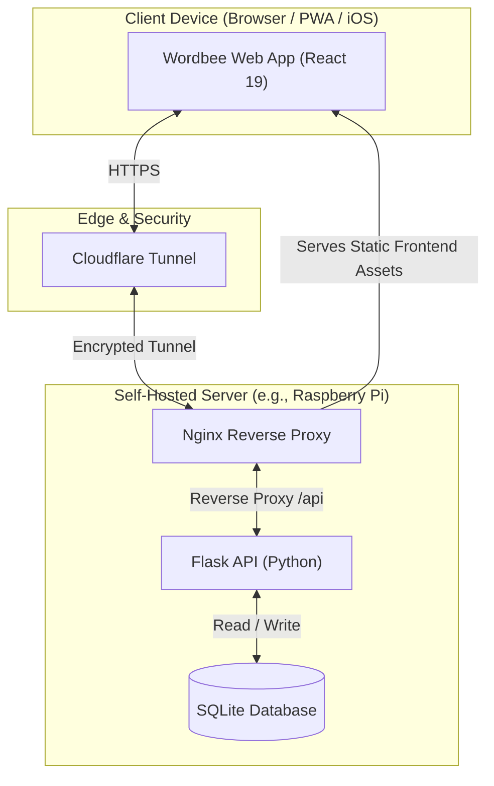

# Wordbee

<p align="center">
  <strong>Wordbee</strong> is a self-hosted private games hub for a friends-and-family group. It brings Wordle, Sudoku, Connections, and Strands together under a clean, unified React 19 interface.
</p>

<p align="center">
  
  
  
  
  
  
  
  
</p>

---

## 🎮 What it does

Wordbee hosts multiple daily and archive puzzles for a private community of friends and family. It includes built-in daily lockout guards, statistics dashboards, and local persistent state synchronization.

> [!NOTE]
> **Friends & Family Access**: The majority of Wordbee's features (such as profile registration, custom avatars, persistent statistics, and history) are locked behind a private access code. Because Wordbee is self-hosted, you can set your own access codes to unlock the site for your family. See [Access Code Configuration](#access-code-configuration) for setup steps.

### Supported Games

| Game | Gameplay Modes | Key Features |
|---|---|---|
| **Wordle** | Daily / Endless / Past-Date | Tile reveal animations, high-contrast & dark mode, starter-word habits, trends, and detailed solve-path analysis |
| **Sudoku** | Daily / Past-Date (Easy/Medium/Hard) | Single-row keypad, Notes/pencil marks, Undo, Erase, Hint, a running timer, live conflict highlighting, and auto-checked completion |
| **Connections** | Daily / Past-Date | 16-card board, 4-card group validation, faithful NYT select/solve-bounce/mistake-shake animations, one-away feedback, and post-loss reveal |
| **Strands** | Daily / Past-Date | Drag or tap path selection, connect-the-dots lines, spangram validation, bonus-word tracking, and an NYT-style theme-word hint |

<details>
<summary>🔍 Detailed Game & Platform Features</summary>

- **Per-Game Archive History**: Every game has its own daily / past-date picker that grays out days before that game's first puzzle and clamps out-of-range dates back into the playable window, mirroring Wordle. Connections and Strands pull real dated NYT puzzles; past Sudoku is recovered from the Internet Archive when a same-day snapshot exists, otherwise a deterministic generated board.
- **Completion Calendar**: Each signed-in user has a per-game calendar back to that game's first puzzle, colored solid green (solved live), washed green (solved from the archive), light red (missed live), and pink (missed from the archive). Tapping a day shows that solve, with current-day privacy preserved.
- **Daily Persistence & Rollover**: Signed-in family users resume unfinished puzzles (any game) from the server. Rollovers resolve to `America/Chicago` by default, blocking future gameplay before Central midnight. The active game and archive date persist for the browser session, so an in-app reload returns where you were while a fresh launch opens the daily Wordle.
- **Friends-and-Family Access**: Private access codes are validated server-side, profiles are reclaimed on load, and one active session is enforced per browser/user.
- **Avatar Profiles**: Profile avatars are rendered from DB-backed state using DiceBear's Notionists SVG API.
- **Stats Dashboard**: Only live daily completions count toward stats; retroactive archive plays are recorded for the calendar but excluded from every stat. The Wordle dashboard contains accolade cards, solve distribution, starter-word history, player trends, skill/luck analysis, and play reviews. Sudoku, Connections, and Strands add family solve-rate, leaderboard, daily review, and calendar views.
- **Privacy Controls**: Current-day answers, guesses, and results remain locked in statistics and the calendar until the requesting user solves that day's puzzle for that game.
</details>

---

## 🏗️ Architecture



---

## 📂 Project Structure

```text
.
├── backend/        # Flask API, SQLite database access, game modules, stats, and auth
├── data/           # Local SQLite database files (ignored by Git)
├── docs/           # Database schema planning, API reference, and auth planning notes
├── frontend/       # Vite + React client source code and features (Wordle, Connections, etc.)
├── infra/          # System configuration templates (nginx, systemd, cloudflared)
├── tests/          # Test execution notes and smoke-test config
├── package.json    # Root command aliases for full-stack development
└── README.md
```

<details>
<summary>📂 Codebase Details</summary>

- **Frontend Structure**: App state and routing are orchestrated in `frontend/src/App.tsx`. Game views are separated in `features/wordle/`, `features/sudoku/`, `features/connections/`, and `features/strands/`. Common layouts and settings are stored in `features/avatar/`, `features/access/`, and `features/stats/`.
- **Backend Structure**: Shared API endpoints live in `backend/app/routes.py`. Game logic and puzzle services are modularized under `backend/app/games/` (e.g., `wordle.py` and `multigame.py`).
</details>

---

## 🚀 Getting Started

### 1. Prerequisites & Installation

Clone the repository and install the dependencies:

```bash
# Clone the repository
git clone https://github.com/MatthewBisbee/Wordbee.git
cd Wordbee

# Install Frontend dependencies
npm --prefix frontend install

# Install Backend dependencies
python3 -m pip install -r backend/requirements.txt
```

### 2. Configure Environment

Copy the template env file:

```bash
cp .env.example .env
```

> [!IMPORTANT]
> Make sure to update the `.env` file before running the application. Important settings:
> - `SECRET_KEY`: Long, random string for signing user sessions.
> - `WORDBEE_PUZZLE_TIMEZONE`: Timezone for game rollover (defaults to `America/Chicago`).

### 🔑 Access Code Configuration

To unlock profile creation and history features, define your private custom group and code in your `.env` file:

1. Open your `.env` file.
2. Edit the `WORDBEE_FRIENDS_FAMILY_CODES` value to match your desired group name and access code:
   ```env
   WORDBEE_FRIENDS_FAMILY_CODES=myfamily:my_secret_code
   ```
   *(e.g., `myfamily` is the group identifier, and `my_secret_code` is the code users type to gain entry).*
3. Multiple groups/codes can be defined if needed, separated by commas.

---

## 💻 Local Development

Use the root-level scripts in `package.json` to run the stack:

| Command | Description |
|---|---|
| `npm run dev` | Runs Flask (`127.0.0.1:5001`) and Vite (`0.0.0.0:5173`) for LAN network testing |
| `npm run dev:local` | Runs Flask and Vite restricted to localhost (`127.0.0.1`) only |
| `npm run api` | Starts only the Flask backend |
| `npm run dev:frontend` | Starts only the Vite frontend dev server |
| `npm run build` | Builds the frontend project into production assets |
| `npm run lint` | Lints the frontend code using Oxlint |

---

## 📡 Data & Content Sources

Wordbee pulls board data dynamically and stores it locally in SQLite:
- **Puzzles**: Daily answers are fetched from public dated puzzle endpoints.
- **Fallback**: Fallbacks are generated deterministically if third-party endpoints fail during start.
- **Definitions**: Integrated with the Free Dictionary API and Datamuse API for Wordle details.
- **Avatars**: Profiles are generated with DiceBear's Notionists SVG endpoint.

---

## 🗺️ Roadmap & Progress

- [x] **Wordbee Game Picker Shell**
- [x] **Wordle Integration** (Daily, Endless, Archive)
- [x] **Sudoku Module** (Mistakes, cell highlighting)
- [x] **Connections Module** (Grid matching, history)
- [x] **Strands Module** (Word paths, spangram reveal)
- [x] **Friends & Family Account Profiles**
- [x] **Detailed Solve Stats & Accolades**
- [x] **Raspberry Pi Reverse Proxy & Cloudflare Scaffolding**
- [ ] **Mobile iOS App Wrapper Polish**

---

## 📄 License

Wordbee is open-source software licensed under the [MIT License](LICENSE).
